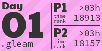

# Advent of Code 2024

My solutions to [Advent of Code 2024](https://adventofcode/2024).

## Gleam solutions
My [Gleam](https://gleam.run) solutions can be found in `advent_gleam`. See the [README](advent_gleam/README.md) there.

## Inputs
Inputs should be put into the directory "input" in the root of the repository, using
name format "day00.txt". These files are not checked in to git as the organizers of
the Advent of Code have specified they may not be shared in this way.

<!-- AOC TILES BEGIN -->
<h1 align="center">
  2024 - 4 ⭐ - Gleam
</h1>

<!-- AOC TILES END -->
